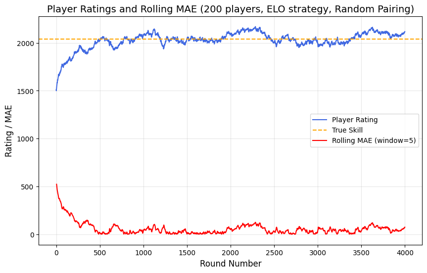

# rating-simulator
(WIP) A Python package for simulating zero-sum games using Monte Carlo methods with customizable rating systems.

Example usage:

```python
# create some players with a Gaussian skill distribution, and initialise their ratings
players = create_players(
    num_players=200, 
    initial_rating=1500, 
    skill_mean=1500, 
    skill_std=400, 
    k_factor=20  # controls rating variability after each game
)

# pick a pairing strategy and update strategy
pairing_strategy = RandomPairingStrategy()
update_strategy = EloUpdateStrategy(draw_prob=0.1)

# instantiate a Simulation object and run the simulation
simulation = Simulation(players, pairing_strategy, update_strategy, num_rounds=1000)
simulation.run()

# analyse the results
player_1 = simulation.players[0]
print([record.rating for record in player_1.history]) # get the rating graph of a player over time
print(player_1.true_skill) # get the true skill of the player. The rating should converge to the true skill over time.

```
The below plot shows the ELO rating evolution over 4000 games of an example player in a pool of 200 players, all with a fixed starting rating of 1500, using the `RandomPairingStrategy`. Convergence (as measured by when the rolling mean absolute error reaches a stable level) seems to happen after around 500 games in this case.



The package currently supports:

- Elo rating system (with optional draw probability)
- Random pairing strategy
  
I've only just started the project, so here are some planned features: 
- data viz utils
- more pairing strategies (round-robin, Swiss)
- more rating systems (Glicko, TrueSkill)
- more simulation options (noisiness, league formats, ability to compare performance of two strategies side-by-side)
- option to adjust the true skill of players as rounds progress
- and more!
